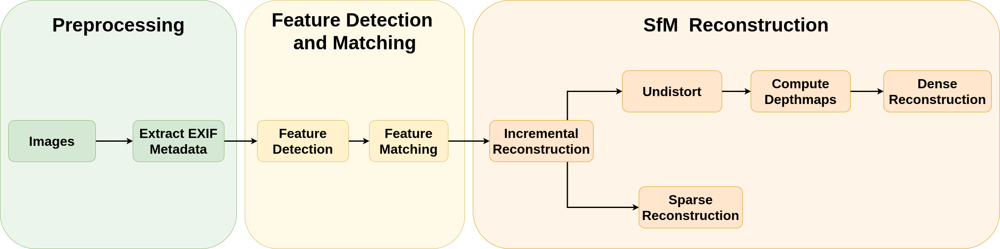

# 3D Reconstruction

## Description
This repository implements 3D Reconstruction using Structure from Motion Pipeline and RGB images. 
The pipeline consists of 
1. Feature Detection (using SURF / SIFT / Hessian Affine Region Detector)
2. Feature Matching (using FLANN)
3. Reconstruction (using Patch Match)

## Pipeline

## Results

